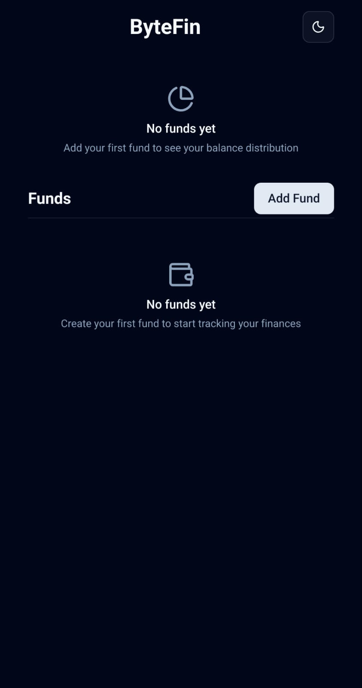

# ByteFin

**A minimalist subaccount tracker for personal financial organization**



## Description

ByteFin is a personal financial management application designed to help you organize and track money within a single bank account by creating separate "funds" or subaccounts. While traditional banking apps show your total balance, they often lack the ability to subdivide money for different financial goals or purposes.

ByteFin solves this by allowing you to:
- Create multiple funds (e.g., Savings, Groceries, Rent, Entertainment)
- Track income and expenses within each fund
- Visualize your balance distribution across different goals
- Maintain a clean, minimalist interface focused on functionality

This application is perfect for individuals who want to better manage their money by allocating portions of their main account balance to specific financial goals without the complexity of multiple bank accounts.

## Features

### Core Functionality
- 🔐 **PIN-based Authentication**: Secure access with personal PIN
- 💰 **Fund Management**: Create, edit, and delete custom funds
- 📊 **Transaction Tracking**: Log income and expenses within each fund
- 📈 **Balance Visualization**: Interactive charts showing fund distribution
- 📱 **Responsive Design**: Works seamlessly on desktop and mobile devices

### User Experience
- 🎨 **Dark/Light Theme**: Toggle between light and dark modes
- 🌍 **Multi-language Support**: Built-in localization system
- ⚡ **PWA Support**: Installable as a progressive web app
- 🎯 **Minimalist Interface**: Clean, distraction-free design
- 🔄 **Real-time Updates**: Instant balance calculations

### Technical Features
- 🔒 **Client-side Data**: Secure local data management
- 📊 **Interactive Charts**: Visual representation of fund balances
- 🎨 **Modern UI**: Beautiful interface using Tailwind CSS and Radix UI
- 📱 **Mobile-First**: Optimized for mobile usage
- ⚡ **Fast Performance**: Built with Next.js for optimal speed

## Screenshots

The application features a clean, modern interface:


*Main dashboard showing fund management and balance visualization*

## Installation

### Prerequisites
- Node.js 18+ 
- pnpm as package manager

### Setup Instructions

1. **Clone the repository**
   ```bash
   git clone https://github.com/thebryanmartinez/bytefin.git
   cd bytefin
   ```

2. **Install dependencies**
   ```bash
   pnpm install
   ```

3. **Run the development server**
   ```bash
   pnpm dev
   ```

4. **Open in browser**
   Navigate to [http://localhost:3000](http://localhost:3000) to see the application.

## Usage

### Getting Started

1. **Authentication**: Enter your PIN to access the application
2. **Create Your First Fund**: Click "Add Fund" to create a new financial goal
3. **Add Transactions**: Click on any fund to add income or expense transactions
4. **Track Progress**: Monitor your fund balances using the interactive charts
5. **Manage Funds**: Edit, delete, or create new funds as your needs change

### Key Workflows

**Creating a New Fund:**
1. Click the "Add Fund" button
2. Enter a fund name (e.g., "Emergency Savings")
3. Set an initial balance (optional)
4. Save the fund

**Adding Transactions:**
1. Select a fund from the list
2. Click "Add Transaction"
3. Enter amount, description, and date
4. Choose transaction type (income/expense)

**Viewing Balance Distribution:**
- The main dashboard shows an interactive chart of all your funds
- Hover over chart segments to see detailed fund information
- Use the chart to understand your current financial allocation

## Tech Stack

### Frontend
- **[Next.js 16.0.1](https://nextjs.org/)** - React framework with App Router
- **[React 19.2.0](https://reactjs.org/)** - UI library
- **[TypeScript](https://www.typescriptlang.org/)** - Type safety and developer experience
- **[Tailwind CSS 4](https://tailwindcss.com/)** - Utility-first CSS framework

### UI Components & Design
- **[Radix UI](https://www.radix-ui.com/)** - Unstyled, accessible UI primitives
- **[Lucide React](https://lucide.dev/)** - Beautiful icons
- **[Recharts](https://recharts.org/)** - Responsive chart library
- **[React Hook Form](https://react-hook-form.com/)** - Form management
- **[Zod](https://zod.dev/)** - TypeScript-first schema validation

### Database & Authentication
- **[Supabase](https://supabase.com/)** - Backend-as-a-Service database
- **[Session Storage](https://developer.mozilla.org/en-US/docs/Web/API/Window/sessionStorage)** - Client-side authentication

### Development Tools
- **[Biome](https://biomejs.dev/)** - Fast formatter and linter
- **[PostCSS](https://postcss.org/)** - CSS transformation
- **[PWA Service Worker](https://developer.mozilla.org/en-US/docs/Web/API/Service_Worker_API)** - Progressive web app capabilities

## Folder Structure

```
bytefin/
├── public/                 
│   ├── app-screenshot.jpeg 
│   ├── favicon.ico        
│   ├── manifest.json      
│   └── sw.js             
├── src/
│   ├── app/              
│   │   ├── api/          
│   │   │   └── validate-pin/    
│   │   ├── login/        
│   │   ├── globals.css   
│   │   ├── layout.tsx    
│   │   └── page.tsx      
│   ├── components/       
│   │   ├── modules/      
│   │   │   ├── BalanceChart.tsx    
│   │   │   ├── Funds.tsx           
│   │   │   ├── Header.tsx          
│   │   │   ├── Loading.tsx         
│   │   │   ├── PINLogin.tsx        
│   │   │   ├── ThemeProvider.tsx   
│   │   │   └── ThemeToggle.tsx     
│   │   └── ui/           
│   │       ├── button.tsx  
│   │       ├── card.tsx    
│   │       ├── chart.tsx   
│   │       ├── dialog.tsx  
│   │       ├── input.tsx   
│   │       └── spinner.tsx 
│   └── lib/              
│       ├── supabase/      
│       │   ├── client.ts         
│       │   └── database.types.ts 
│       ├── useAuth.ts     
│       ├── useSupabase.ts 
│       ├── useLocalization.ts 
│       ├── types.ts       
│       ├── utils.ts       
│       └── locales.json   
├── supabase/             
│   └── config.toml       
├── .gitignore           
├── biome.json           
├── components.json      
├── next.config.ts       
├── package.json         
├── postcss.config.mjs   
└── tailwind.config.ts   
```

### Key Directories

- **`src/app/`** - Next.js App Router pages and layouts
- **`src/components/modules/`** - Feature-specific React components
- **`src/components/ui/`** - Reusable UI building blocks
- **`src/lib/`** - Core utilities, hooks, and configurations
- **`supabase/`** - Database schema and configuration
- **`public/`** - Static assets including PWA files

## License

This project is private and for personal use.

---

**ByteFin** - Simplifying personal finance management through intelligent fund organization.
